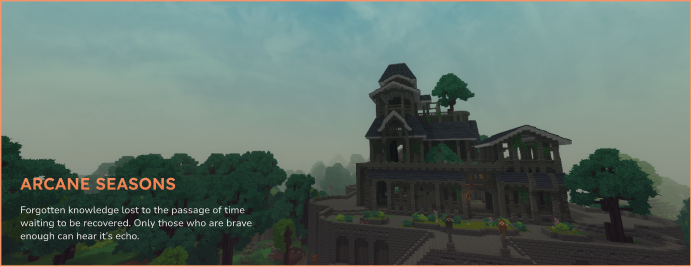

# Arcane Seasons

A Hytale server plugin that adds a dynamic seasonal system with Echo Worlds—alternate realms where players can experience unique seasonal environments.

## Features

- **Echo Worlds**: Travel to seasonal realms via portals with their own unique environments
- **Grass Tinting**: Season-specific grass coloration updates with each echo world
- **Player Progression**: Sleep to advance seasons (5 sleeps = 1 season transition) (scrapped)
- **Portal System**: Bidirectional teleportation between main world and echo worlds with cooldown protection
- **Weather Integration**: Season affects rainfall, snow, and temperature modifiers (scrapped)

(eh, works kinda but not as well as i'd like)
- **Four Seasons**: Automatically progresses through Spring → Summer → Fall → Winter on a 360-day cycle

## Commands

- `/season panel` – Opens the seasonal control panel UI
- `/season get` – Displays current season information
- `/season set <season>` – Manually change the season (Spring/Summer/Fall/Winter)

## How It Works

### Seasonal Progression
Seasons advance based on accumulated player sleep. Each player sleep contributes 20% progress toward the next season. After 5 sleeps (100% progress), the season automatically transitions and progress resets.

### Echo Worlds
Each season has a corresponding Echo World (Spring Echo, Summer Echo, Fall Echo, Winter Echo) that players can access via portals. These worlds:
- Load on-demand when first entered
- Apply season-specific grass tinting automatically
- Use consistent sunny weather for visual consistency
- Persist player progression separately

### Portal Mechanics
- Players can enter portals to travel to echo worlds
- Exits allow return to the original world
- A 3-second cooldown prevents rapid re-entry
- Portal selection UI appears on entry

## Architecture

Built on Hytale's **ECS (Entity Component System)** architecture:
- **Modular Systems**: Separate systems for tinting, portals, weather, and player progression
- **Data-Driven Design**: Season properties, structures, and prefabs defined through configuration
- **Lazy Loading**: Echo worlds only created when needed
- **Multiplayer Ready**: Full support for multiple players with synchronized seasonal changes

## Building
```bash
./gradlew build
```

## Development (Saves/Modding)
```bash
make dev
```

Built with **Java 25** using Gradle 9.2.1.


Honestly got a bit carried away with building, theres more I
wanted to add but got scrapped because of time
